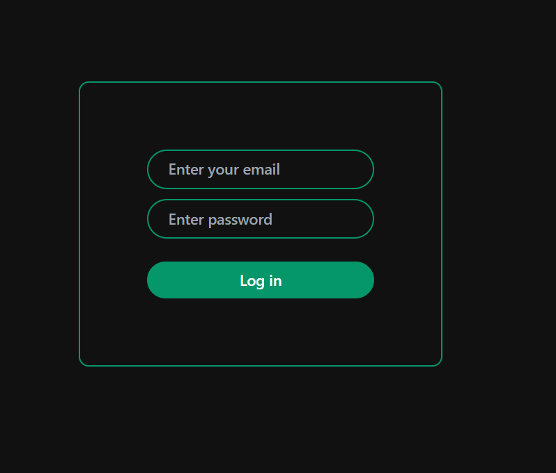
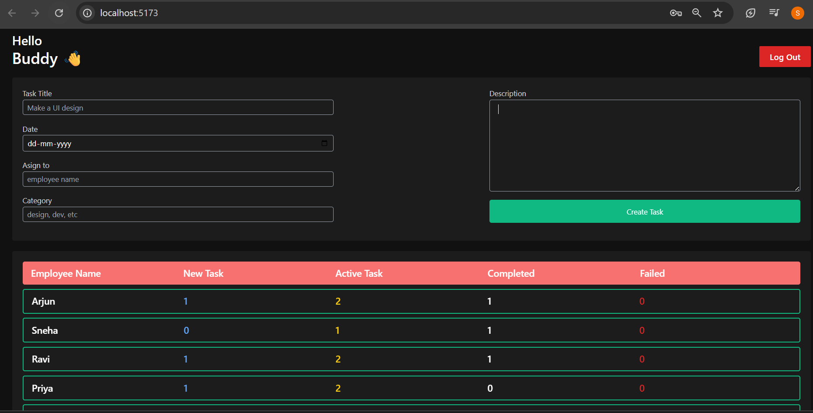

# React + Vite

## 🚀 Employee Management System

A sleek and efficient Employee Management System built with React, HTML, CSS, and JavaScript 💻.  
👨‍💼 Admins can assign tasks to employees, while 👷‍♂️ employees can view, update, and mark tasks as completed ✅.  
📋 Easy task tracking, clean UI, and smooth interactions for seamless workforce management.  
Perfect for teams looking to boost productivity and stay organized! 📈

"# Some of the Employee-Management-System's Screenshots " 

